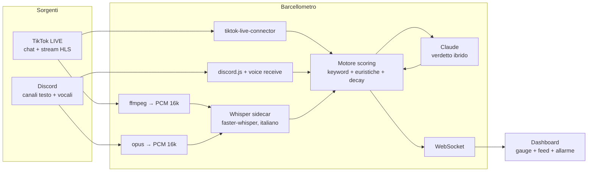

<div align="center">


# 🌸🍿 BARCELLOMETRO 🍿🌸

**Rilevatore di *barcello* (litigi, dissing e drama) in tempo reale per live TikTok e server Discord — analisi di chat e audio.** ✨

*💖 Edizione speciale dedicata a [@cricetomannaro000](https://www.tiktok.com/@cricetomannaro000) 🐹💖*


🌸 ─────────── 🍿 ─────────── 🌸

</div>

> 🚧 **WORK IN PROGRESS** — Il progetto è in sviluppo attivo. API, configurazione e funzionalità possono cambiare senza preavviso.

---

## Cos'è

Il **Barcellometro** è una webapp self-hosted che monitora in tempo reale una o più sorgenti live (dirette TikTok, server Discord) e misura su una scala 0–100 il livello di *barcello*: litigi, dissing, scontri verbali, drama tra streamer o tra utenti.

Il termometro del drama funziona su **due canali paralleli**:

- **Chat** — ogni messaggio della live TikTok e dei canali testuali Discord viene analizzato istantaneamente
- **Audio** — l'audio della diretta TikTok e dei canali vocali Discord viene trascritto localmente con Whisper e analizzato come il testo, con rilevamento delle urla tramite analisi del volume (RMS)

Quando il barcello supera la soglia critica scatta l'allarme: sirena, flash rosso, notifica browser. 🍿

## Come funziona il punteggio

Ogni sorgente ha un motore di scoring indipendente con **decadimento esponenziale** (emivita 45 s): il punteggio sale con gli eventi ostili e si raffredda da solo quando torna la pace.

| Segnale | Peso |
|---|---|
| **Dizionario italiano del barcello** — ~150 pattern pesati: insulti, minacce, escalation legali ("ti querelo"), marker di drama ("rissa", "dissing", 🍿) | 1–10 per match |
| **CAPS LOCK** prolungato e punteggiatura aggressiva (`!!!`) | +1.5 – 3 |
| **Picco di velocità della chat** — la chat esplode rispetto al baseline (3×) in presenza di ostilità | +6 |
| **Litigio 1v1** — due utenti che si alternano rapidamente con toni ostili | +10 |
| **Parlato** — le keyword nelle trascrizioni audio pesano ×1.5 rispetto alla chat | ×1.5 |
| **Urla** — volume RMS sopra il baseline della live + contenuto ostile | +4 – 10 |
| **Verdetto AI** — Claude conferma il barcello o smorza i falsi allarmi | fusione score |

### Livelli

```
  0–20   💤  Quiete piatta
 20–40   👀  Tensione nell'aria
 40–60   ⚠️  Frizione rilevata
 60–80   🥊  BARCELLO!
80–100   🔥🍿  BARCELLO TOTALE
```

### Classificazione ibrida con AI

Le keyword da sole non distinguono il trash talk amichevole dal litigio vero. Quando lo score supera la soglia (default 40), gli ultimi ~25 messaggi/trascrizioni vengono sottoposti a **Claude**, che risponde con un verdetto strutturato (barcello sì/no, intensità, protagonisti, sintesi). Il verdetto viene fuso nello score: conferma i picchi veri e smorza i falsi allarmi.

Due provider supportati:

| Provider | Requisiti | Costo |
|---|---|---|
| `claude-sdk` *(default)* | CLI [Claude Code](https://docs.claude.com/en/docs/claude-code) installata e autenticata | Incluso nella subscription Claude |
| `api` | `ANTHROPIC_API_KEY` | Pay-per-token |

Senza AI il Barcellometro funziona comunque in modalità solo keyword+euristiche.

### 🔔 Rilevatori AI personalizzati

Oltre al barcello, puoi definire dalla dashboard **rilevatori su misura** in linguaggio naturale: *"avvisami se parlano di cucina"*, *"se nominano il criceto"*, *"se qualcuno chiede soldi"*. A intervalli regolari (configurabile) Claude analizza il contesto recente di ogni sorgente e, quando una condizione è soddisfatta, ricevi notifica + toast + evento nel feed, con la citazione che lo dimostra. Cooldown anti-spam per rilevatore.

### 🤖 Interventi attivi del bot Discord

Il bot non si limita a osservare: nella sezione dedicata della UI definisci **criteri di intervento** e il bot agisce nel server quando scattano:

- **💬 Chat** — scrive un messaggio nel canale testuale attivo
- **🔊 Voce** — *parla* nel canale vocale con voce neurale italiana (Edge TTS, 4 voci disponibili)
- Il messaggio può essere **fisso** (lo scrivi tu) o **generato da Claude** in base a quello che sta succedendo
- Esempi: *"se il barcello supera 70 → riporta la calma"*, *"se insultano il criceto → difendilo"*
- Cooldown configurabile e test immediato dalla UI

## Architettura



| Componente | Tecnologia |
|---|---|
| Backend | Node.js 20+, Express, ws |
| Chat TikTok | [tiktok-live-connector](https://github.com/zerodytrash/TikTok-Live-Connector) v2 |
| Audio TikTok | ffmpeg sull'HLS della live → chunk PCM 16 kHz |
| Discord | discord.js v14 + @discordjs/voice (ricezione per-utente) |
| Trascrizione | [faster-whisper](https://github.com/SYSTRAN/faster-whisper) (CPU int8, sidecar Flask) |
| AI | Claude via CLI (subscription) o Anthropic API |
| Frontend | Single-page vanilla JS, WebSocket, SVG gauge |

## Installazione

### Requisiti

- Node.js ≥ 20
- Python ≥ 3.10 (solo per l'audio)
- ffmpeg (solo per l'audio TikTok)

### Windows

```bat
install.bat   :: verifica requisiti + installa dipendenze + crea .env
start.bat     :: avvia Whisper sidecar + server + apre la dashboard
```

### Linux / VPS

```bash
git clone https://github.com/frede1983/barcellometro.git
cd barcellometro
npm install
pip3 install -r whisper/requirements.txt
cp .env.example .env   # configura le chiavi
python3 whisper/server.py &   # sidecar audio
node server/index.js          # dashboard su :3900
```

Per il deploy con systemd vedi [`deploy/`](deploy/).

## Configurazione

**Tutto è configurabile dalla dashboard** (⚙️ Impostazioni): token Discord, provider e modello AI, chiavi API, modello Whisper (ricaricato a caldo), soglie, cooldown, password, voce TTS, rilevatori e interventi. Le modifiche si salvano in `config.json` e si applicano senza riavvio (dove serve il riavvio, c'è il pulsante 🔄 nella UI).

Il file [`.env`](.env.example) resta solo come bootstrap opzionale; `config.json` ha sempre la precedenza. Chiavi principali:

| Variabile | Descrizione | Default |
|---|---|---|
| `PORT` | Porta dashboard | `3900` |
| `AI_PROVIDER` | `claude-sdk` \| `api` \| `off` | `claude-sdk` |
| `AI_MODEL` | Alias (`haiku`) o modello API completo | `haiku` |
| `AI_TRIGGER_SCORE` | Score che attiva il giudizio AI | `40` |
| `DISCORD_BOT_TOKEN` | Token bot Discord (per monitorare Discord) | — |
| `TIKTOK_SIGN_API_KEY` | API key [Euler Stream](https://www.eulerstream.com) (opzionale) | — |
| `AUDIO_ENABLED` | Analisi audio on/off | `true` |
| `WHISPER_MODEL` | `tiny` \| `base` \| `small` \| `medium` | `small` |
| `DASH_PASSWORD` | Basic Auth dashboard (utente `barcello`) — obbligatoria su VPS pubblici | — |

### Setup bot Discord

1. [Discord Developer Portal](https://discord.com/developers/applications) → **New Application** → sezione **Bot** → copia il token in `DISCORD_BOT_TOKEN`
2. Attiva **MESSAGE CONTENT INTENT**
3. **OAuth2 → URL Generator**: scope `bot`, permessi *View Channels, Read Message History, Connect* → invita il bot nel server
4. Il bot entra nei canali vocali **mutato** e ascolta soltanto

## Uso

1. Apri la dashboard (`http://localhost:3900`)
2. **TikTok**: inserisci lo `@username` di un creator *attualmente in live* → **Monitora**
3. **Discord**: scegli server e canale vocale → **Monitora server**
4. Il gauge centrale mostra il barcello massimo tra le sorgenti; il feed evidenzia messaggi incriminati, trascrizioni (🎙) e verdetti AI (🤖)
5. Log permanente degli eventi in `logs/eventi-AAAA-MM-GG.jsonl`

## Roadmap

- [x] v1.0 — Chat + audio TikTok/Discord, scoring ibrido, dashboard, allarmi
- [x] v1.1 — Configurazione completa dalla UI (config.json + hot-apply)
- [x] v1.1 — Rilevatori AI personalizzati ("avvisami se parlano di...")
- [x] v1.1 — Interventi attivi del bot Discord in chat e in voce (Edge TTS)
- [x] v1.2 — Moderazione AI con regolamento scritto dall'utente + enforcement
- [x] v1.2 — Registro Discord, schede profilo, match TikTok, rubrica cross-host
- [x] v1.2 — Donazioni e classifica putt (fedeltà community)
- [ ] Storico barcelli con replay della timeline
- [ ] Clip automatiche dei momenti di picco
- [ ] Notifiche Telegram/Home Assistant
- [ ] Multi-lingua (ES/EN)
- [ ] Rilevamento barcello nei live match (linkMicBattle TikTok)

## Note legali e privacy

- Questo strumento analizza contenuti **pubblici** (live TikTok) e server Discord in cui **hai autorità e consenso**. Se ascolti un canale vocale, informa i partecipanti.
- La connessione a TikTok avviene tramite reverse engineering non ufficiale ([tiktok-live-connector](https://github.com/zerodytrash/TikTok-Live-Connector)): nessuna garanzia, uso a tuo rischio.
- Il progetto è a scopo di intrattenimento. Il barcello rilevato non costituisce parere legale. 🍿

## Licenza

[MIT](LICENSE) © 2026 [frede1983](https://github.com/frede1983)

<div align="center">

🌸 ─────────── 💖 ─────────── 🌸

<sub>Fatto con 🍿 e tanto rosa per la comunità del barcello — powered by criceti mannari 🐹✨💖</sub>
</div>
